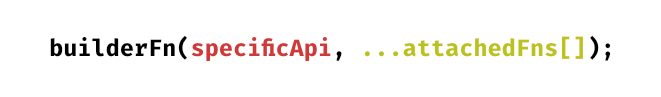

# Getting Started: Faketastic

Faketastic is a library that helps you with modeling your data objects in a readable, flexible and extensible way. After defining your models you can then generate random data from it, that respects the restrictions of your models.

## Installation

To install faketastic simply run:

`$ npm install faketastic`

## Basics

Before starting with modelling concrete examples, it is useful to understand the single building blocks of faketastic. Thus, this "Getting Started" explains these building blocks first and merges the knowledge gradually until a sample model was completely created.

### Builder Functions: Anatomy of a Data Description

Let's dive into some examples in order to understand how to define data with faketastic. The basic building blocks of faketastic are called builder functions (abbr. "BuilderFns").

Builder functions allow you to describe the type and frame of expected data. Seen from a very high level they look like this:



1. The first parameters are specific to any builder function. There are builder functions without any (required) parameters and their are some that expect your input.
2. After those required parameters, you can add an arbitrary number of [attached functions](./attached-fns/attached-fns.md). We will have a closer look on these functions, later on.

When we zoom in a bit, we might see something like that:


Here, we have a concrete example of a builder function in use. [oneOf](./builder-fns/one-of.md) is a builder function that expects one parameter: An array that contains the values to randomly choose an item from. In this example we just passed the values `[1, 2, 3]`. After this parameter is passed-in, we **can** add additional [attached functions](./attached-fns/attached-fns.md). In this example we added [canBe](./attached-fns/can-be.md) and [map](./attached-fns/map.md).

> Since we does not have to add attached functions, it is completely legal to call `oneOf` like this:
>
> ```ts
> oneOf([1, 2, 3]);
> ```

Let's see another example to get used to the shape of builder functions.


[range](./builder-fns/range.md) is another builder function which requires two parameters. It returns a random number from a given range. Thus it needs the minimum and maximum value as input. After they have been given, again, we can add an arbitrary list of [attached functions](./attached-fns/attached-fns.md).

This way we describe data and their restrictions in faketastic.

### Attached Functions in a nutshell

We have seen some [attached functions](./attached-fns/attached-fns.md) by now. They get added to builder functions in order to affect their generated value somehow. To gain a better understanding, have a closer look to the latest example:


We declare a range from `1 to 99`, but attach the [canBe](./attached-fns/can-be.md) function to say, that the value can also be `-1`. But wait, when will it be `-1`? The short answer is: by 50/50 chance. But `canBe` has another, optional parameter that allows you to change the likelihood from 0.5 (50/50) to what ever you like:

`function canBe(value: any, likelyhood = 0.5) {}`

As we omitted the `likelyhood` parameter, there is a 50/50 chance, that the original value gets replaced with the value given to `canBe`.

#### Subtypes of AttachedFns

`canBe` is just one example for an attached function. In fact there are three sub-types of attached functions:

1. **TreeReaderFns**: Skipping for now (not important for direct usage).
2. **ArchitectFns**: Restructures the [build-tree](./topics/build-mechanism.md)-node it is attached to. The most common example is [quantity](./overview.md#architects).
3. **ProcessorFns**: Changes or replaces the result of the builder function it is attached to. `canBe` and `map`, in fact, are processor functions.

#### Build-Cycles

> Detailed information about build cycles can be found [here](./topics/build-mechanism.md).

Attached functions can choose when they want to be executed. There are different points in time, when attached functions are run, so there are the following types of attached functions:

1. **Initializers**: They run before anything was built yet. They are useful for architects like `quantity` for example. They can restructure the [build-tree](./topics/build-mechanism.md) before any value was evaluated yet.
2. **Preprocessors**: They run the moment just before the builder function result gets evaluated. This cycle is useful when replacing this exact value as there is no need to evaluated the builder function result, then.
3. **Postprocessors**: They run the moment just after the result of the builder function was evaluated. This cycle is useful when the attached function needs to react to the evaluated result.
4. **Finalizers**: They run after everything was built. This cycle is useful for resolving references or reading values from other – already built – properties.

> **Side Note**
> There is no way (yet?) to see what type of attached function something is: `canBe` is a preprocessor and `quantity` is an initializer, but we have no clue about that, until we look into their implementations. This might change somehow in future versions of faketastic, via naming conventions for example, but for today it is more or less a blackbox without the source code.

### Create your first Model!

By now we have only seen isolated calls of builder functions that produces results we never used. Also we attached functions that affects these results, but we could not use or see those either.

Now, we turn our knowledge into models, so that we have something we can play with. Have a look on this code:

```ts
import { model, oneOf, range } from 'faketastic';

const Names = ['Sara', 'Peter'];
const $Person = model({
  name: oneOf(Names),
  age: range(18, 99),
  isMarried: oneOf([true, false], canBe(null)),
});
```

Here, we describe a person in a (simple) model. We say, that a person has:

- a `name`, that is one of `['Sara', 'Peter']`
- an `age` which is within the range of `18 to 99`.
- and a flag whether the person is married, which could also be `null` for some reason.

We now have a model. Models can be considered as something like `classes` in programming languages. They describe entities, but this is only a receipt how to build it, and not actual instances. To generate mock data out of it, we need to build it:

```ts
import { model, oneOf, range, build } from 'faketastic';

const Names = ['Sara', 'Peter'];
const $Person = model({
  name: oneOf(Names),
  age: range(18, 99),
  isMarried: oneOf([true, false], canBe(null)),
});

const samplePerson = build($Person);
// => { name: "Sara", age: 29, isMarried: false }
```

> **Note: build, in fact, is also a builder function!** This means that you can attach functions here, too:
>
> ```ts
> const persons = build($Person, quantity(3));
> // => [
> //  { name: 'Sara', age: 22, isMarried: true },
> //  { name: 'Peter', age: 41, isMarried: null },
> //  { name: 'Peter', age: 18, isMarried: false },
> // ]
> ```
>
> The full signature of build is:
>
> `function build(value: Buildable, ...attachedFns: AttachedFn[])`

### There is more to it: Reuse Models

Earlier we said that models are something like `classes` in programming languages. There is more to it, as you can reuse models the same way, you would do with classes in programming. Take a look on this code snippet:

```ts
const PetNames = ['Bobby' /* , ... */];
const FurColors = ['Black/White' /* , ... */];

const $Pet = model({
  name: oneOf(PetNames),
  age: range(1, 20),
  legCount: range(0, 4),
});

const $Dog = extend($Pet, {
  furColor: oneOf(FurColors),
});

const $Bird = extend($Pet, {
  legCount: 42,
});

const pet = build($Pet);
// => { name: "Bobby", age: 11, legCount: 2 }

const dog = build($Dog);
// => { name: "Bobby", age: 20, legCount: 3, furColor: "Black/White" }

const dog = build($Bird);
// => { name: "Bobby", age: 4, legCount: 42 }
```

In this example we have seen that you can **extend** models, so that the reusability of models is as high as possible. We also figured out that you can override already existing properties with new values, as `$Bird` always has the value `42` as `legCount`, whereas other pets have a value between `0 and 4`.

> **Please note:** The comparison of models with `classes` is not perfect as many concepts we know from programming has no application with models in this context. For example there is no "polymorphism" or something like that with models. Models, under the hood, aren't even ES6 classes, but plain old javascript-objects.

### References

Sometimes when modelling, you have data-dependent descriptions. For example when modelling a person, the name is dependent on the gender chosen. In those cases we need to somehow compute the name dependent of the gender. Faketastic supports references within models via the `ref` builder function.

```ts
const $Person = model({
  // for simplicity, implementation is left out here.
  name: ref('gender', map(toNameFromGender)),
  gender: oneOf(['f', 'm']),
});
```

In the `name` property we reference the `gender` property and map this value to a function which will somehow turn the gender into a gendered name. The implmentation was left out for simplicity (see [here](#quick-example) if relevant).

The `ref` builder writes the referenced target-value in `finalize`-build cycle as value. `map`, which is also a `finalizer` runs after `ref`'s implementation and can read the resolved reference, in order to convert the gender into a valid name. These kinds of references help you to keep semantics within your models.

#### Restrictions

Please note, that `ref` will only resolve property names, that are on the same level or lower, which means that you cannot target parent properties (yet). See the following code as reference:

```ts
const $Company = model({
  name: oneOf(…),
  employees: [
    {
      // fails, as it does not read parent properties.
      worksAt: ref('name'),
    }
  ]
});
```

The other way round works, though:

```ts
const $Person = model({
  // will resolve to "Johnson"
  lastName: ref('lastName'),
  children: [
    {
      name: 'Billy',
      lastName: 'Johnson',
    },
  ],
});
```
This is no technical restriction, but rather a conceptual one. In general a more specific and deeper nested model should not need to know anything about it's parent. Therefore we do not accept references to parent properties.

**If this is problematic for a valid use case, please tell us, so that we can fix it!**

### Try it yourself!

In order to get started, the best you can do is - try it yourself. You may want to have a look on the following pages for a [complete list of built-in functionality](./overview.md).

Faketastic is made to be extensible. If the built-in functionality isn't enough for your use case, you can always help yourself by [writing custom functionality](./topics/custom-code.md)!

#### **Quick Example**

Here we need to synchronize the name with the gender to keep semantics. We write a custom processor function which reads the reference to the gender property and turn it

```ts
import { build, createProcessorFn, model, oneOf, quantity, ref } from 'faketastic';

const femaleNames = ['Sara', 'Mandy'];
const maleNames = ['Peter', 'Dennis'];
const $Person = model({
  name: ref('gender', toGenderName(femaleNames, maleNames)),
  gender: oneOf(['f', 'm']),
});

const output = build($Person, quantity(4));
// => [
//  { name: 'Dennis', gender: 'm' },
//  { name: 'Mandy', gender: 'f' },
//  { name: 'Sara', gender: 'f' },
//  { name: 'Sara', gender: 'f' },
// ]

type GenderString = 'm' | 'f';

function toGenderName(femaleNames: string[], maleNames: string[]) {
  return createProcessorFn(node => {
    const gender: GenderString = node.value;
    const nameSource = gender === 'm' ? maleNames : femaleNames;
    node.value = randomItem(nameSource);
  }, 'finalizer');
}
```
> In case you wonder why our custom processor function gets a `ObjectTreeNode` as input parameter, please take a look [here](./topics/build-mechanism.md).
