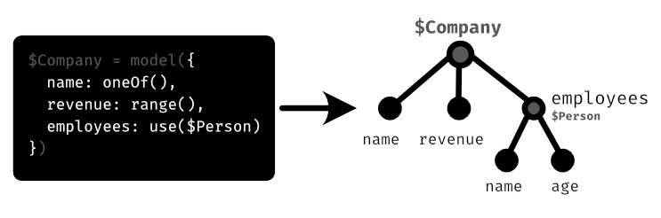

## Under the Hood: Building Mechanism

Let's take an excursus for better understanding. Consider the following model:

```ts
const $Person = model({
  name: oneOf(/*...*/),
  age: range(/*...*/),
});
```

The whole model, when called with `build($Person)`, will be converted into a tree-like structure:



This tree is temporary while building and called "Build-Tree". As shown above, each node represents a property. Additionally (not shown in the picture), each node stores its value, which might be the result of a builder function (`range(1, 99)`) or a static value, such as `42`.

Builder functions take user input and turn it into something that is called `Buildables`. When building, faketastic traverses the whole build-tree and looks for those `buildables`. When a node has a buildable value (value of type `Buildable`), it calls its `attached functions`. In fact, it does not only traverse the tree one time, but four times. Each traversion is a "Build Cycle". `Attached functions` declare in which cycle they desire to run, thus they can be of type:

1. **Initializers**: These functions run before *anything* was built. All buildables have their intial value state and nothing was done yet.
2. **Preprocessors**: They run the moment just before the value is set on the buildable they are attached to. The build-tree may already be partially built, so that some values might already be set.
3. **Postprocessors**: They run the moment just after the value was set on the buildable they are attached to. The build-tree is already partially built, so that some values might already be set.
4. **Finalizers**: These functions run after everything has been built.

```ts
// returns a buildable with necessary build information:
name: oneOf(['Item1', 'Item2']);
```

As seen, the property `name` is assigned to the result of `oneOf`. This result is an object of type `Buildable`. `Buildable`s contain important information, like which attached functions are present and the current value.

`oneOf` returns a buildable that includes a processor, that – as soon it gets called – randomly choose an item, turns it into a tree and append this tree to its own node, so that it gets part of the whole build-tree and thus, will be evaluated as well.
