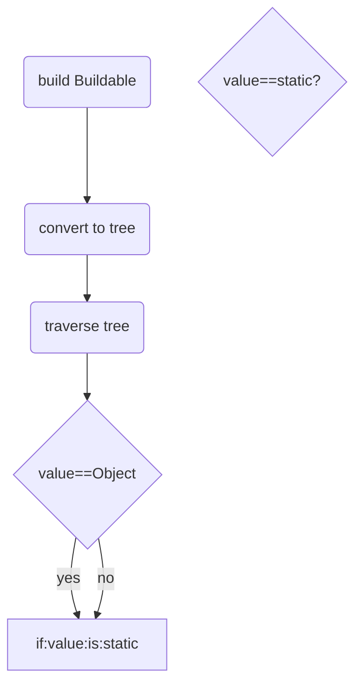

# Build Process

1. Convert input into object tree
2. Traverse tree
3. Foreach node:
   1. If static value: set; done.
   2. If buildable:
   3. Run readers
   4. Run architects
   5. Run preprocessors
   6. If buildable.value is ValueFn:
      1. execute and assign result as node.value
      2. If result is buildable start over at step 1
   7. Run postprocessors
   8. set result;
   9. Return built value

```ts
// the main result can be null
builder(quantity(2), canBe(null));
// each created item can be null
builder(quantity(2, canBe(null)));
```

```ts
builder(Buildable<BuildFn>);
builder(staticValue);
builder(object);
builder(array);
```


